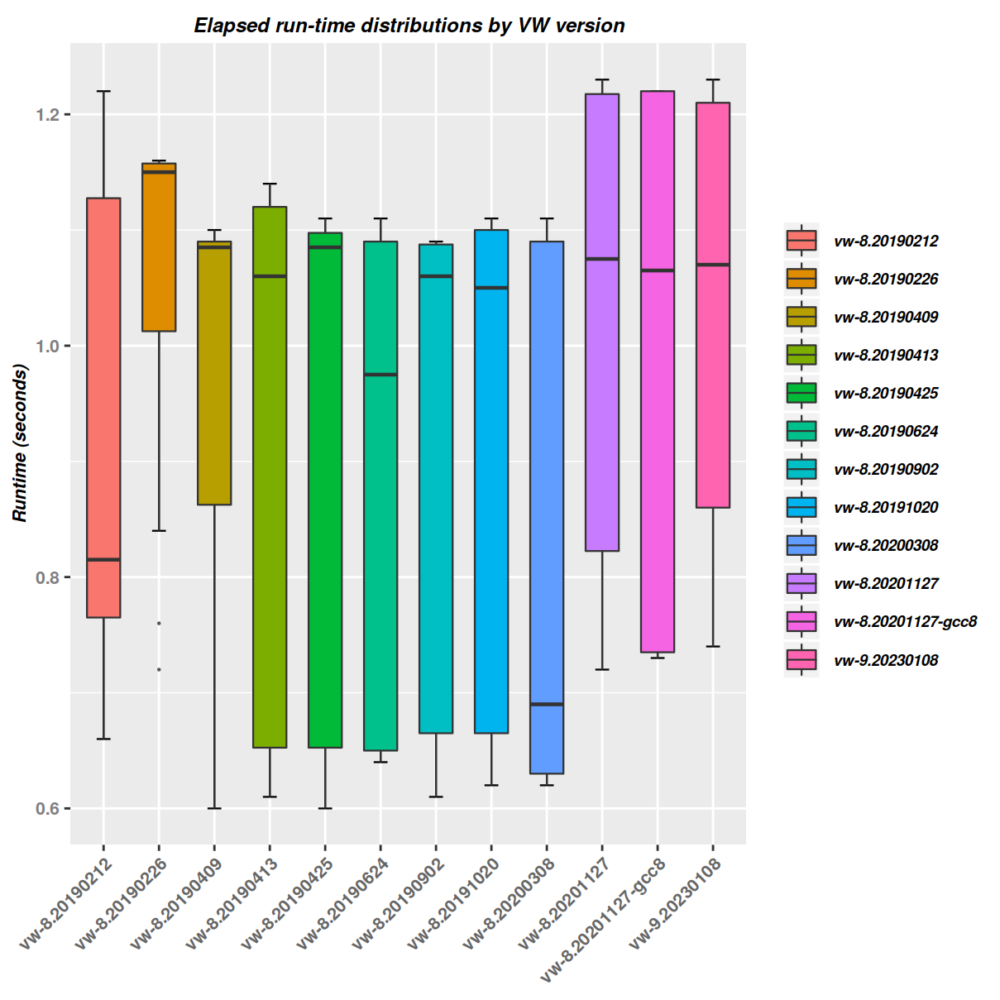

# vw-speed

Benchmark &amp; chart vw runtime changes over time

## Overview

This repository allows you to benchmark vw binary versions and compare
their (learning) run-times over time.

There's a set of (statically linked + optimized) binaries included
to make it easy to reproduce. The included binaries are all:

    ELF 64-bit LSB executable, x86-64 (Intel/AMD) GNU/Linux

The [Makefile](Makefile) allows you to adjust:

  - The runtime options via `VWOPTS`
  - The vw binaries used via `VW_BINARIES`
  - The training-set via `TRAINSET`
  - The timings log file via `LOGFILE`

The chart gets generated using `R/ggplot` from the `LOGFILE`.

## HOWTO

    #
    # Create a simple EXAMPLES x FEATURES training-set
    # Will create a file: trainset.$(EXAMPLES)-$(FEATURES).vw.gz
    #
    make EXAMPLES=500000 FEATURES=10 trainset

    #
    # Run once
    #
    make [VW=...] [VWOPTS='...'] timeone

    #
    # Log training time for all the VW binaries
    #
    make timeall

    #
    # Generate a chart from the timing logs
    #
    make chart

## Example chart

<!--
    -rw-r----- 1 ariel ariel 84125 Nov 26  2020 vw-timings-2020-11-26.png
    -rw-r----- 1 ariel ariel 95739 Jan 10  2021 vwver-boxplot-2021-01-10.png
-->

