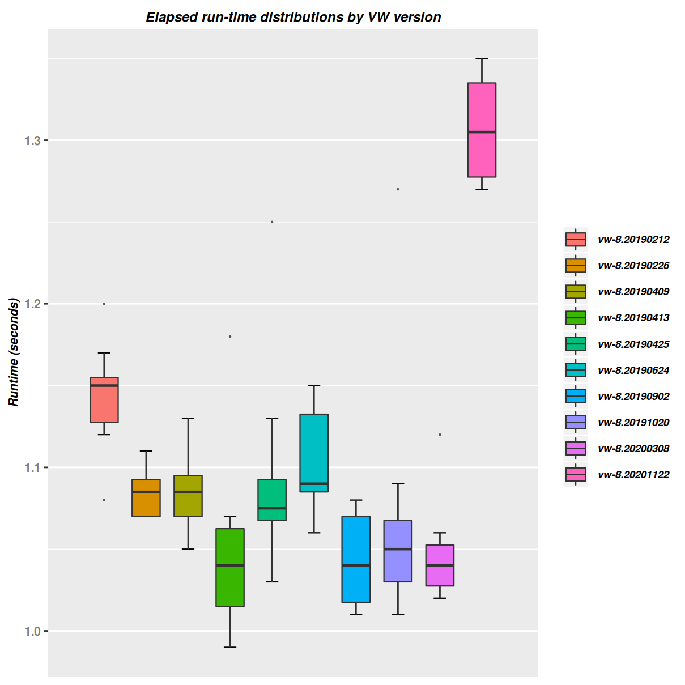

# vw-speed
Benchmark &amp; chart vw runtime changes over time

## HOWTO

    #
    # Create a simple EXAMPLES x FEATURES training-set
    # Will create a file: trainset.$(EXAMPLES)-$(FEATURES).vw.gz
    #
    make EXAMPLES=500000 FEATURES=10 trainset

    #
    # Run once
    #
    make [VW=...] [VWOPTS='...'] timeone

    #
    # Log training time for all the VW binaries
    #
    make timeall

    #
    # Generate a chart from the timing logs
    #
    make chart

## Example chart

